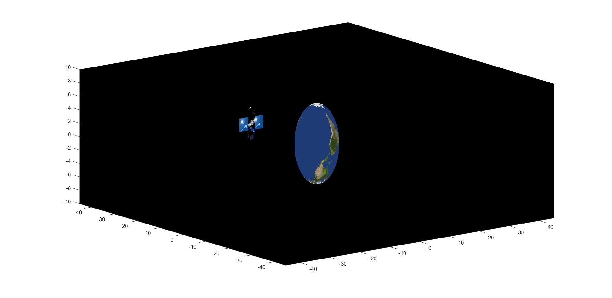

# Orbit Explore
This is our university project. It was programmed using Matlab. It demonstrates two rotating objects, a sattelite and the earth where sattelite programmed to orbit around the earth. 

#### Deutsch
Das ist unser Universitätsprojekt. Es wurde mit Matlab programmiert. Es demonstriert zwei rotierende Objekte, einen Satteliten und die Erde, wobei der Sattelit darauf programmiert wurde, die Erde zu umkreisen. 

## Output 

## Group Members
- [Farrukh Ashraf](https://de.linkedin.com/in/farrukh-ashraf-3a7b13137)
- [Muhammad Hamza Bashir]()
- [Jawwad Gill]()
- [Luka Wernke]()
- [Zain Ali Sher]()
- [Moaiad Ahmed]()

## Special Mentions
Special thanks to [Björn Wendt](https://de.linkedin.com/in/bj%C3%B6rn-wendt-89285441) for all the guidance and help.

#### Deutsch
Besonderer Dank geht an [Björn Wendt](https://de.linkedin.com/in/bj%C3%B6rn-wendt-89285441) für all die Anleitung und Hilfe.

